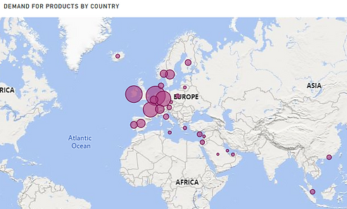

### PROFESSIONAL SUMMARY
Experienced data analyst with a track record of driving business impact through data-driven strategies and
operational optimization. Strong technical skills in Python, SQL, R, and Excel, complemented by expertise in
machine learning and data analysis automation.

### CAREER HIGHLIGHTS
- **Efficiency Increase:** Designed sales strategies from sales data insights that resulted in a 25% sales lift.
- **Cost Saving:** Provided value-for-money technology suggestions leading to 6% reduction in production cost.
- **Process Improvement:** Developed reusable analysis components with Mitosheet for faster analysis.

### KEY SKILLS
- Data Analysis
- Data Visualization
- Python, SQL, R, Excel, MatLab, Linux
- Power BI
- Github
- Outlook

### WORK EXPERIENCE
#### Cognifyz Technologies  
**Data Analyst Internship** (Mar. 2024 - Apr. 2024)  
- Demonstrated proficiency in data cleaning, transformation, and exploratory analysis through Jupyter Notebook exercises with pandas, numpy, matplotlib and mitosheet python libraries.
- Gained exposure to working with a comprehensive restaurant dataset, including analyzing and visualizing information about restaurant locations, cuisines, ratings, and other relevant attributes.
- Developed a strong foundation in Python programming and its application to data-driven problem-solving.  

#### Frankis Multimedia, Ghana, Tarkwa
**Data Analyst** (2019 – 2022)
- Led the collection and analysis of customer feedback data and identified key areas for service
improvements; implementing changes that led to 30% increment in customer satisfaction and a 25%
reduction in customer complaints.
- Scrutinized data from sales and used the outputs to inform the decision of when to have discounts and
promotions, increasing patronage and profit by 21%.
- Cut projected time for data analysis by one week by developing reusable analysis components using
Mitosheet.
- Designed sales strategies for make-up artists based on regression analysis, identifying key attributes to
increase business reach and popularity, resulting in a 25% sales lift.
- Identified photography trends together with appropriate tools and advised management on cost
effective procurements reducing the cost of production by 6%.

#### University of Mines and Technology, Ghana, Tarkwa
**Teaching and Research Assistant** (2018 – 2019)
- Evaluated and optimized transient analysis methods using MatLab, resulting in a 20% reduction in
analysis time and improved accuracy of results.
- Conducted research that led to the modification of statistical distributions into new ones that were 32%
more efficient in modeling engineering and health data.
- Coached 5 final year undergraduate students on the use of the Homotopy Perturbation Method for
disease modelling using Maple software for their final BSc thesis work.

### EDUCATION
- **Master of Science, Nanotechnology**, Politechnika Gdańska, Poland, Gdansk | 2024
- **Master of Science, Mathematical Engineering**, University of L'Aquila, Italy, L'Aquila | 2024
- **Bachelor of Science, Mathematics**, University of Mines and Technology, Ghana, Tarkwa | 2018

### PROJECTS
#### 1. Natural Gas Price Prediction Using Machine Learning

* Demonstrated the application of machine learning techniques for time series forecasting in the energy sector.
* Developed a robust prediction system for natural gas prices, showcasing abilities in handling time series data, applying machine learning algorithms, and optimizing models.

#### 2. Accenture North America Data Analytics and Visualization

 * Completed a simulation focused on advising a hypothetical social media client as a Data Analyst at Accenture
 * Cleaned, modelled and analyzed 7 datasets to uncover insights into content trends to inform strategic decisions
 * Prepared a PowerPoint deck and video presentation to communicate key insights for the client and internal stakeholders
 * Data Modeling, Data Understanding, Data Visualization, Presentations, Project Planning, Storytelling, Teamwork, Data Analysis

#### 3. Tata Data Visualisation: Empowering Business with Effective Insights

 * Completed a simulation involving creating data visualizations for Tata Consultancy Services
 * Prepared questions for a meeting with client senior leadership
 * Created visuals for data analysis to help executives with effective decision making
 * Skills: Data Analysis, Visualisation, Effective Insights and Communications, Presentations

    
#### 4. British Airways Data Science

 * Completed a simulation focussing on how data science is a critical component of British Airways success.
 * Scraped and analysed customer review data to uncover findings.
 * Built a predictive model to understand factors that influence buying behaviour.
 * Skills: Python, Web scrapping, Natural Language Processing, EDA

[CLICK HERE](https://github.com/Inkoom-Justice/Data_in_challenges) for more projects on my github platform.
